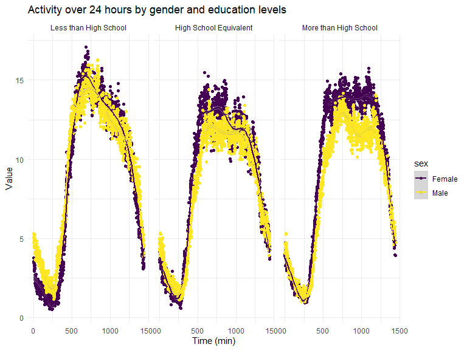

P8105 Homework 3
================
Pavithra Srinivasan,
11 Oct 2023

### Problem 1

#### Read in the data

``` r
data("instacart")

instacart = 
  instacart |> 
  as_tibble()
```

#### Answer questions about the data

This dataset contains 1384617 rows and 15 columns, with each row
resprenting a single product from an instacart order. Variables include
identifiers for user, order, and product; the order in which each
product was added to the cart. There are several order-level variables,
describing the day and time of the order, and number of days since prior
order. Then there are several item-specific variables, describing the
product name (e.g. Yogurt, Avocado), department (e.g. dairy and eggs,
produce), and aisle (e.g. yogurt, fresh fruits), and whether the item
has been ordered by this user in the past. In total, there are 39123
products found in 131209 orders from 131209 distinct users.

Below is a table summarizing the number of items ordered from aisle. In
total, there are 134 aisles, with fresh vegetables and fresh fruits
holding the most items ordered by far.

``` r
instacart |> 
  count(aisle) |> 
  arrange(desc(n))
```

    ## # A tibble: 134 × 2
    ##    aisle                              n
    ##    <chr>                          <int>
    ##  1 fresh vegetables              150609
    ##  2 fresh fruits                  150473
    ##  3 packaged vegetables fruits     78493
    ##  4 yogurt                         55240
    ##  5 packaged cheese                41699
    ##  6 water seltzer sparkling water  36617
    ##  7 milk                           32644
    ##  8 chips pretzels                 31269
    ##  9 soy lactosefree                26240
    ## 10 bread                          23635
    ## # ℹ 124 more rows

Next is a plot that shows the number of items ordered in each aisle.
Here, aisles are ordered by ascending number of items.

``` r
instacart |> 
  count(aisle) |> 
  filter(n > 10000) |> 
  mutate(aisle = fct_reorder(aisle, n)) |> 
  ggplot(aes(x = aisle, y = n)) + 
  geom_point() + 
  labs(title = "Number of items ordered in each aisle") +
  theme(axis.text.x = element_text(angle = 60, hjust = 1))
```


Our next table shows the three most popular items in aisles
`baking ingredients`, `dog food care`, and `packaged vegetables fruits`,
and includes the number of times each item is ordered in your table.

``` r
instacart |> 
  filter(aisle %in% c("baking ingredients", "dog food care", "packaged vegetables fruits")) |>
  group_by(aisle) |> 
  count(product_name) |> 
  mutate(rank = min_rank(desc(n))) |> 
  filter(rank < 4) |> 
  arrange(desc(n)) |>
  knitr::kable()
```

| aisle                      | product_name                                  |    n | rank |
|:---------------------------|:----------------------------------------------|-----:|-----:|
| packaged vegetables fruits | Organic Baby Spinach                          | 9784 |    1 |
| packaged vegetables fruits | Organic Raspberries                           | 5546 |    2 |
| packaged vegetables fruits | Organic Blueberries                           | 4966 |    3 |
| baking ingredients         | Light Brown Sugar                             |  499 |    1 |
| baking ingredients         | Pure Baking Soda                              |  387 |    2 |
| baking ingredients         | Cane Sugar                                    |  336 |    3 |
| dog food care              | Snack Sticks Chicken & Rice Recipe Dog Treats |   30 |    1 |
| dog food care              | Organix Chicken & Brown Rice Recipe           |   28 |    2 |
| dog food care              | Small Dog Biscuits                            |   26 |    3 |

Finally is a table showing the mean hour of the day at which Pink Lady
Apples and Coffee Ice Cream are ordered on each day of the week. This
table has been formatted in an untidy manner for human readers. Pink
Lady Apples are generally purchased slightly earlier in the day than
Coffee Ice Cream, with the exception of day 5.

``` r
instacart |>
  filter(product_name %in% c("Pink Lady Apples", "Coffee Ice Cream")) |>
  group_by(product_name, order_dow) |>
  summarize(mean_hour = mean(order_hour_of_day)) |>
  pivot_wider(
    names_from = order_dow, 
    values_from = mean_hour) |>
  knitr::kable(digits = 2)
```

    ## `summarise()` has grouped output by 'product_name'. You can override using the
    ## `.groups` argument.

| product_name     |     0 |     1 |     2 |     3 |     4 |     5 |     6 |
|:-----------------|------:|------:|------:|------:|------:|------:|------:|
| Coffee Ice Cream | 13.77 | 14.32 | 15.38 | 15.32 | 15.22 | 12.26 | 13.83 |
| Pink Lady Apples | 13.44 | 11.36 | 11.70 | 14.25 | 11.55 | 12.78 | 11.94 |

## Problem 2

``` r
library(p8105.datasets)
data("brfss_smart2010")
```

#### First, do some data cleaning:

- format the data to use appropriate variable names;
- focus on the “Overall Health” topic
- include only responses from “Excellent” to “Poor”
- organize responses as a factor taking levels ordered from “Poor” to
  “Excellent”

``` r
brfss_df = 
  brfss_smart2010 |>
  janitor::clean_names() |>
  select(-location_id) |>
  filter(topic == "Overall Health") |>
  mutate(
    response = factor(response, levels = c("Poor", "Fair", "Good", "Very good", "Excellent"))
  ) |>
  arrange(response)
```

Data set description: There are a total of 22 variables, 10625 rows and
22 columns.

#### Answer questions about the data:

##### 1. In 2002, which states were observed at 7 or more locations? What about in 2010?

``` r
State_Location_2002 = 
  brfss_df |>
  filter(year == 2002) |>
  group_by(year, locationabbr) |>
  summarize(nloc = n_distinct(geo_location)) |>
    filter(nloc >= 7) |>
    knitr::kable()
```

    ## `summarise()` has grouped output by 'year'. You can override using the
    ## `.groups` argument.

``` r
State_Location_2010 = 
  brfss_df |>
  filter(year == 2010) |>
  group_by(year, locationabbr) |>
  summarize(nloc = n_distinct(geo_location)) |>
    filter(nloc >= 7) |>
    knitr::kable()
```

    ## `summarise()` has grouped output by 'year'. You can override using the
    ## `.groups` argument.

In 2002, 6 states (CT, FL, MA, NC, NJ, PA) were observed at 7 or more
locations and in 2010, 14 states (CA, CO, FL, MA, MD, NC, NE, NJ, NY,
OH, PA, SC, TX, WA) were observed at 7 or more location.

##### 2. Construct a dataset that is limited to Excellent responses, and contains, year, state, and a variable that averages the data_value across locations within a state. Make a “spaghetti” plot of this average value over time within a state (that is, make a plot showing a line for each state across years – the geom_line geometry and group aesthetic will help).

``` r
excellent_responses =
  brfss_df |>
  filter(response == "Excellent") |>
  select(year, locationabbr, data_value) |>
  group_by(locationabbr, year) |>
  mutate(
    avg_data_value = mean(data_value, na.rm = TRUE)
  ) 
spaghetti_plot =
  ggplot(excellent_responses, aes(x = year, y = avg_data_value, group = locationabbr, color = locationabbr)) +
  geom_line() +
  labs(
    title = "Avg data value within a state",
    x = "Year",
    y = "Avg data value",
    color = "State",
    theme(plot.title = element_text(hjust = 0.5)
    ))
spaghetti_plot
```


Observations: The Avg Data Value seems to fluctuate between 2002-2010
for most states, but notably there was a steep decrease in West Virginia
in the year 2005 and again in 2009.

##### 3. Make a two-panel plot showing, for the years 2006, and 2010, distribution of data_value for responses (“Poor” to “Excellent”) among locations in NY State

``` r
brfss_df |> 
  select(year, data_value, locationabbr, locationdesc, response) |> 
  filter(
    year == 2006 | year == 2010,
    locationabbr == "NY") |> 
  ggplot(aes(x = data_value, fill = response)) +
  geom_boxplot(aes(fill = response), alpha = .5) +
   
  labs(
    title = "Data Values Across different Locations in NY State",
    x = "Data Value",
    fill = "Response") + 
  facet_grid(. ~ year)
```


Observations: Overall, 2006 and 2010 have a similar distribution of data
values (ranging “excellent” to “poor”) across NY State locations. Data
values were the lowest among those who answered “poor” and the highest
among those who answered “very good.” The plots also look like it can
potentially be left skewed, and there were more data values recorded in
2010.

## Problem 3

##### Read, tidy, merge, and organize the nhanes accel and covar data sets. Your final dataset should include all originally observed variables; exclude participants less than 21 years of age, and those with missing demographic data; and encode data with reasonable variable classes

``` r
accel_df = 
  read_csv("./data/nhanes_accel.csv") |>
  janitor::clean_names()
```

    ## Rows: 250 Columns: 1441
    ## ── Column specification ────────────────────────────────────────────────────────
    ## Delimiter: ","
    ## dbl (1441): SEQN, min1, min2, min3, min4, min5, min6, min7, min8, min9, min1...
    ## 
    ## ℹ Use `spec()` to retrieve the full column specification for this data.
    ## ℹ Specify the column types or set `show_col_types = FALSE` to quiet this message.

``` r
covar_df =
  read_csv("./data/nhanes_covar.csv", skip = 4) |>
  janitor::clean_names() |> 
  mutate(
    sex = case_match(
      sex,
      1 ~ "Male",
      2 ~ "Female"),
    education = case_match(
      education,
      1 ~ "Less than High School",
      2 ~ "High School Equivalent",
      3 ~ "More than High School"),
    education = factor(
      education,
      levels = c("Less than High School", "High School Equivalent", "More than High School")
    ))
```

    ## Rows: 250 Columns: 5
    ## ── Column specification ────────────────────────────────────────────────────────
    ## Delimiter: ","
    ## dbl (5): SEQN, sex, age, BMI, education
    ## 
    ## ℹ Use `spec()` to retrieve the full column specification for this data.
    ## ℹ Specify the column types or set `show_col_types = FALSE` to quiet this message.

``` r
nhanes_combined = 
  full_join(accel_df, covar_df) |> 
  drop_na() |> 
  filter(age >= 21)
```

    ## Joining with `by = join_by(seqn)`

``` r
view(nhanes_combined)
```

##### Produce a reader-friendly table for the number of men and women in each education category, and create a visualization of the age distributions for men and women.

``` r
nhanes_education_table = 
  nhanes_combined |>
  group_by(sex,education) |>
  summarize(count = n()) |>
  knitr::kable(digits = 1)
```

    ## `summarise()` has grouped output by 'sex'. You can override using the `.groups`
    ## argument.

Lets create a plot for the combined data!

``` r
nhanes_education_table = 
  ggplot(nhanes_combined, aes(x = education, y = age, fill = sex)) +
  geom_boxplot() +
  labs(title = "Distribution of Age by Gender Across Education Levels",
       x = "Education Level",
       y = "Age") +
  theme_minimal() +
  theme(axis.text.x = element_text(angle = 45, hjust = 1))

nhanes_education_table
```


Description: The plot shows the age distributions by gender in each
education category. Both men and women with education levels above high
school have a lower avg age compared to those in other education
categories. Specifically, among the female group those who had a high
school education had the highest density of people, versus in the male
group those with below high school education levels had a higher density
of people. In terms of age, women with a high school education were
older than men at the same educational level.

##### Using your tidied dataset, aggregate across minutes to create a total activity variable for each participant. Plot these total activities (y-axis) against age (x-axis); your plot should compare men to women and have separate panels for each education level. Include a trend line or a smooth to illustrate differences. Comment on your plot.

``` r
nhanes_total_activity_plot = 
  nhanes_combined |> 
  group_by(education, sex) |> 
  mutate(total_activity = rowSums(across(min1:min1440))) |> 
  ggplot(aes(x = age, y = total_activity, color = education)) +
  geom_point(alpha = .5) +
  facet_wrap(~education) +
  geom_smooth() +
  labs(
    title = "Total Activity by Age Across Education Levels",
    x = "Age",
    y = "Activity") +
  theme(plot.title = element_text(hjust = 0.5))

nhanes_total_activity_plot
```

    ## `geom_smooth()` using method = 'loess' and formula = 'y ~ x'


Description: There is a direct proportional relationship between age and
activity. As participants age, their total level of activities decreases
with time. Similarly, there is a decrease in activity across all
educational levels as well. One thing to note, is that participants in
the “less than high school” education category had the highest total
activity at 20 years of age and also the lowest activity at 80 years of
age.

##### Make a three-panel plot that shows the 24-hour activity time courses for each education level and use color to indicate sex.

``` r
three_panel_plot = 
  nhanes_combined |> 
  group_by(education, sex) |>
  summarise(across(starts_with("min"), ~ mean(.), .names = "mean_{.col}")) |>
  pivot_longer(cols = starts_with("mean_"), names_to = "time", values_to = "mean_value") |>
  mutate(time = as.numeric(substring(time, 9))) |> 
  ggplot(aes(x = time, y = mean_value, color = sex)) +
  geom_point() + 
  geom_smooth() +
  facet_grid(. ~ education) +
  labs(x = "Time (min)", y = "Value") +
  ggtitle("Activity over 24 hours by age, gender and education levels") +
  theme_minimal()
```

    ## `summarise()` has grouped output by 'education'. You can override using the
    ## `.groups` argument.

``` r
three_panel_plot
```

    ## `geom_smooth()` using method = 'gam' and formula = 'y ~ s(x, bs = "cs")'


